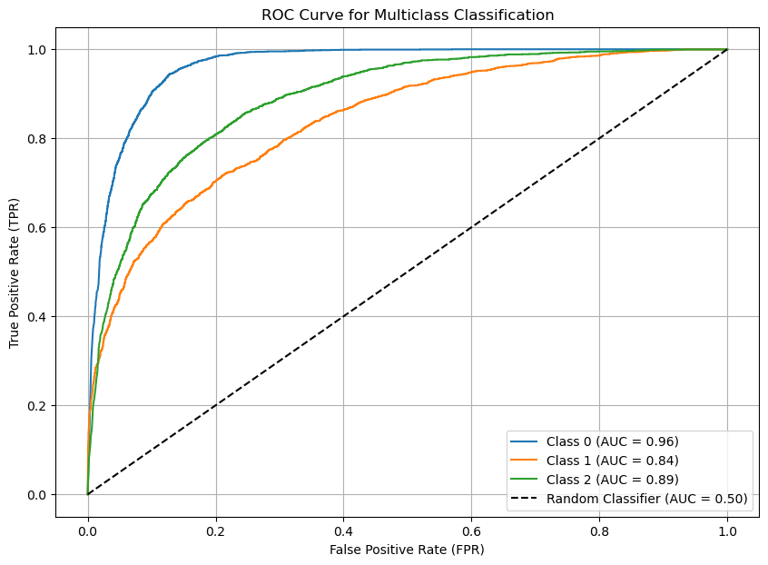

# GSOC-2025 Submission - Deep Lense

I am currently applying the Project :- [Foundation Model for Gravitational Lensing](https://ml4sci.org/gsoc/2025/proposal_DEEPLENSE1.html).

## Structure of Repository

```bash
   ./
    |-- dataset/
    |-- Models/
    |-- utils/
    |-- Task-1-Training-and-Results/
    |    |-- Task1Resnet.ipynb
    |
    |-- Task-6-Training-and-Results/
    |    |-- GSOCTasks.ipynb
    |
    |-- dataset/
    |    |
    |    |-- DatasetTask1
    |    |-- DatasetTask6A
    |    |-- DatasetTask6B
```

The final submissions are the files Task1Resnet.ipynb and GSOCTasks.ipynb. The model implementaions can be found in the `Models/` folder and the Training and Dataset implementations can be found in the `utils/` folder. **NOTE: The file corresonding to Task6, *GSOCTasks.ipynb*, was made on Google Colab**.

## Tasks, Models and Results

The task submission and specifications can be found in the documentation: `GSoC25_DeepLense_Tests.pdf`. We are given two tasks, a common task, and the second task specific to the Foundational Models.

### Task 1: Multi Class Classification (Common Task)

The first task is common to all Deep Lense projects and the second one is specific to the Foundational Models task. Common Task involves Multi-Class classification on image data, provided on the dataset (link can be found in documentation). For this task we employ a ResNet model, who's implementation can be found in `Models/ResNet.py`. The choice of the model is following the results from the Paper: [Decoding Dark Matter Substructure without Supervision](https://arxiv.org/abs/2008.12731). This implementation achieves an AUC Score of **<span style="color:Green">0.96, 0.84 and 0.89</span>** on the three classes: **No Sub**, **Sphere** and **Vortex** respectively. We obtain these results over training using **Cross Entropy Loss** and **Adam** optimizer. This is done 90 epochs. The detailed results can be found in the attached pictures:



### Task 6: Foundational Model with Masked Auto Encoder

We train a [Masked Auto Encoder (MAE)](https://arxiv.org/abs/2111.06377) to over multiple tasks. The data used here can be found 
